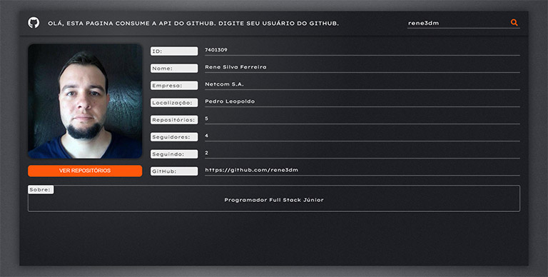
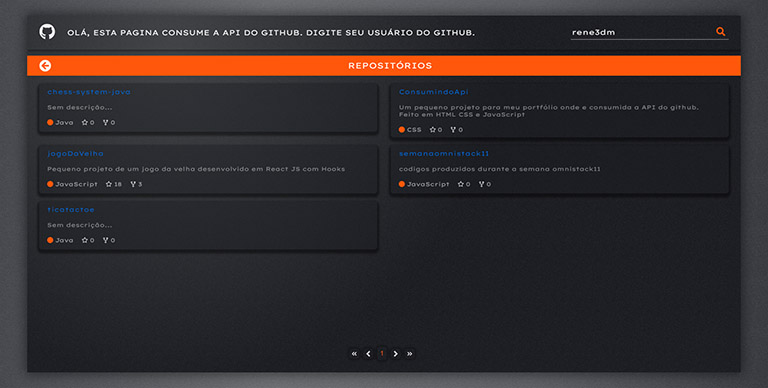

# 
 Consumindo API do GitHub 

 Este projeto tem como objetivo consumir a api do github e mostrar os dados em tela. Na página do repositório há uma paginação de 10 em 10 itens, um menu da paginação que mostra de 5 em 5 páginas, em dispositivos com menores resoluções é mostrado de 3 em 3 páginas. O layout é responsivo

 

 
✅ Assuntos abordados:

* Consumir uma API
* Mostrar dados dinamicamente
* Fazer uma paginação
* Layout responsivo
* Pequenos efeitos de animações
 

 🛠 Tecnologias 

* JavaScript

* CSS

* HTML

 
 
#### <a href="https://rene3dm.github.io/ConsumindoApi/">🔗 Site do projeto</a>
 
 

